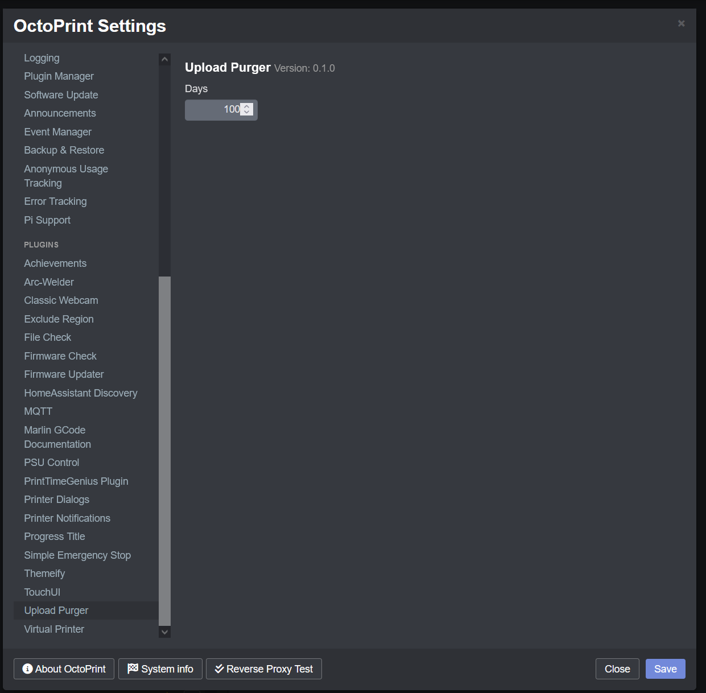

# Upload Purger

This plugin will automatically delete uploaded files that are older than a configured number of days.

## Setup

Install via the bundled [Plugin Manager](https://docs.octoprint.org/en/master/bundledplugins/pluginmanager.html)
or manually using this URL:

    https://github.com/lexitus/OctoPrint-UploadPurger/archive/master.zip

## Configuration

Enter number of days in settings.

## Get Help

If you experience issues with this plugin or need assistance please use the issue tracker by clicking issues above.

## Credits
This plugin forked from [Octoprint-TimelapsePurger](https://github.com/jneilliii/OctoPrint-TimelapsePurger) by [jneilliii](https://github.com/jneilliii)
